# Spring Fw Notes
frontend is the look and feel.

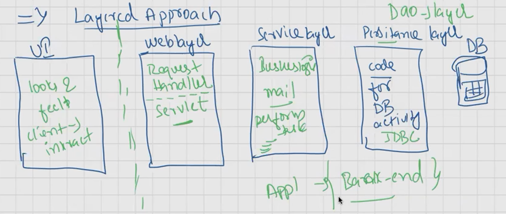
backend is the actual development

spring is versatile means it can merge with the other softwares easily.
spring is non invasive.
using spring we can acheive loose coupling
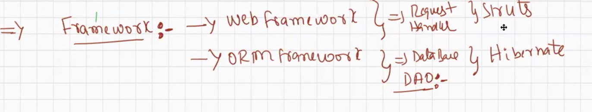
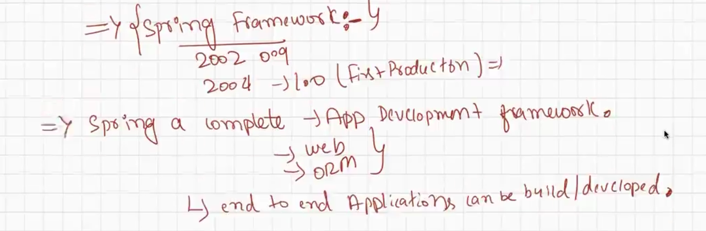
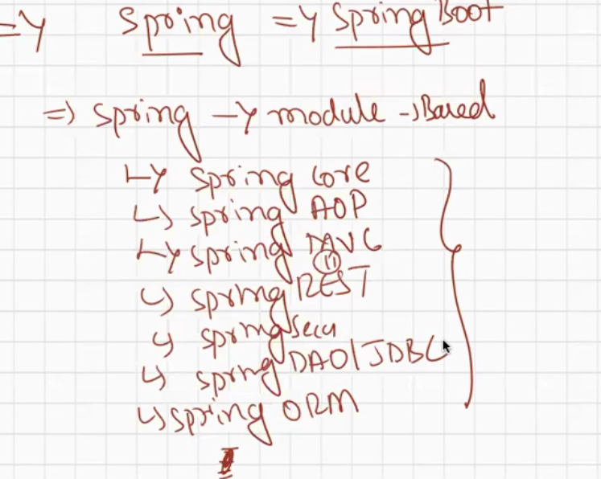
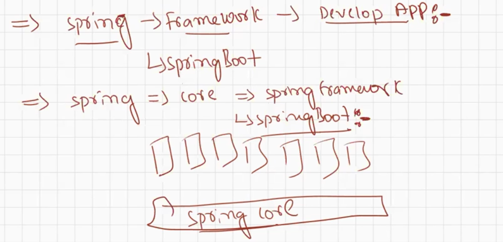
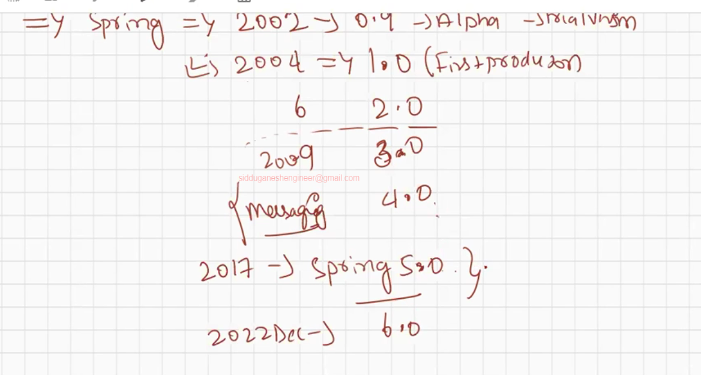

servlet is invasive
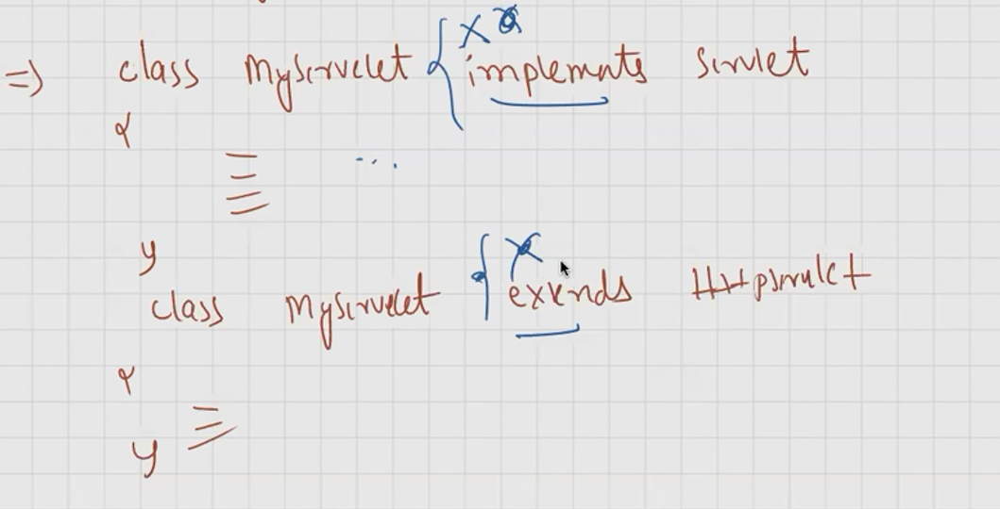

objects gets transferred from one layer to another layer
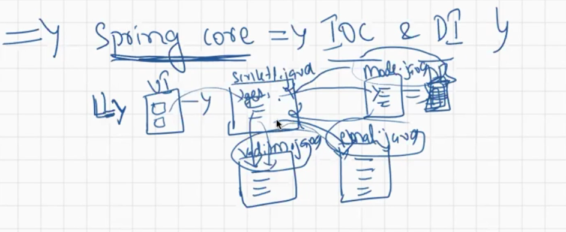

(composition vs aggregation)

CALL THE BEHAVIOURS OF CLASSES THEN spring IOC WILL MANAGES THE OBJECTS
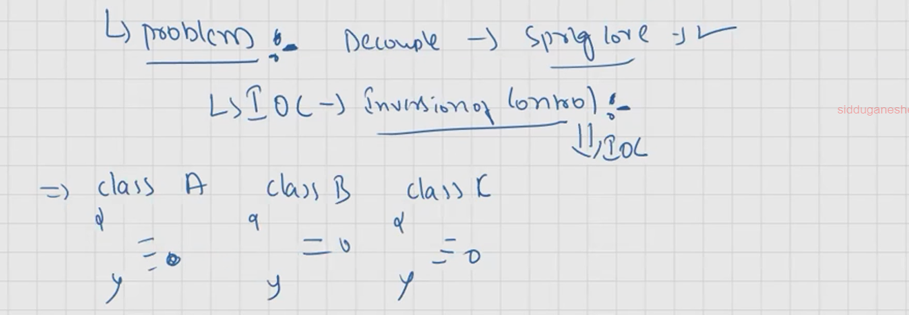

strategy design pattern means best approaches and practices of developing the application in efficient manner.

GOF(gang of four)
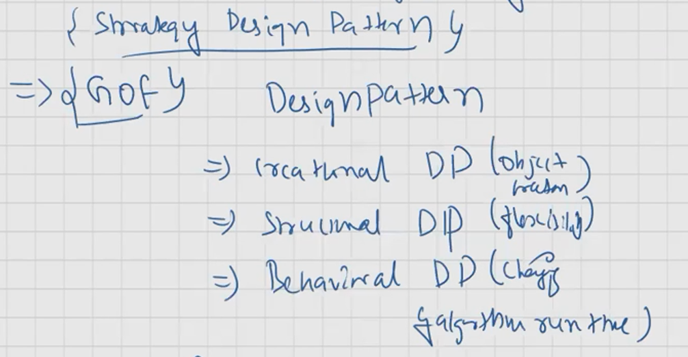
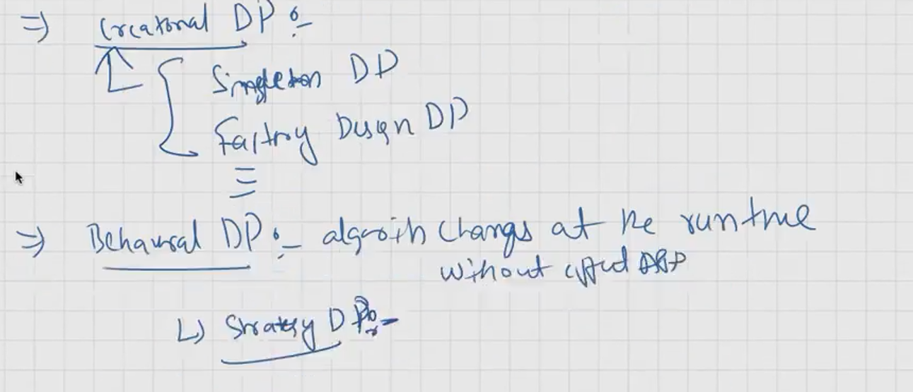
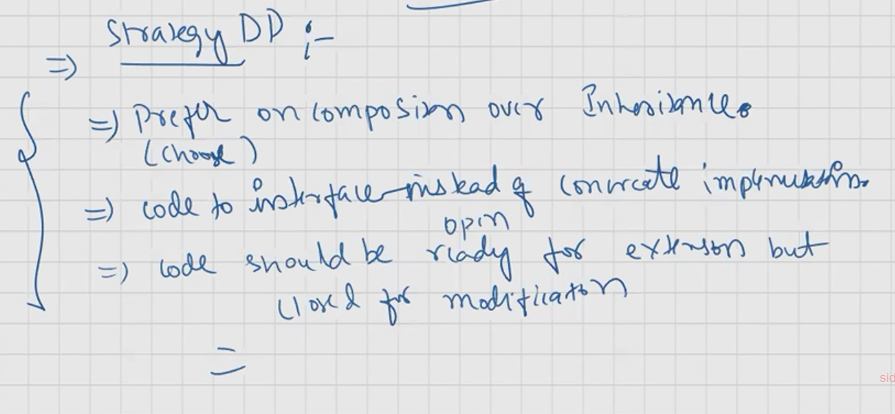

objects created and managed by the IOC then that is called as Bean.
we  need to provide the meta data (using xml file or annotations.)
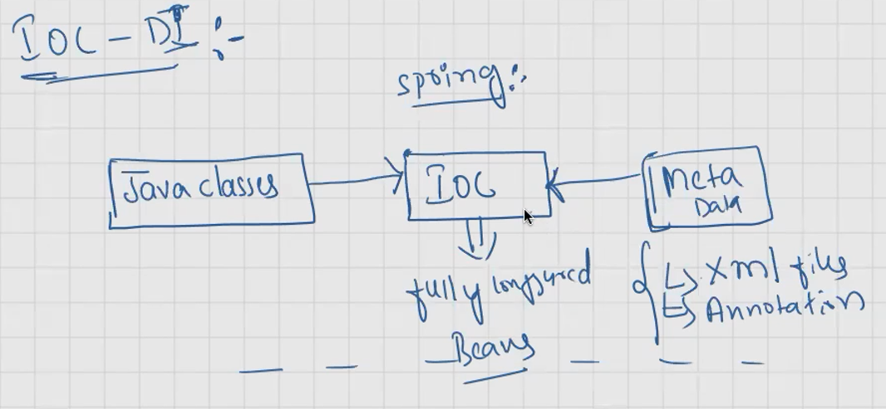
