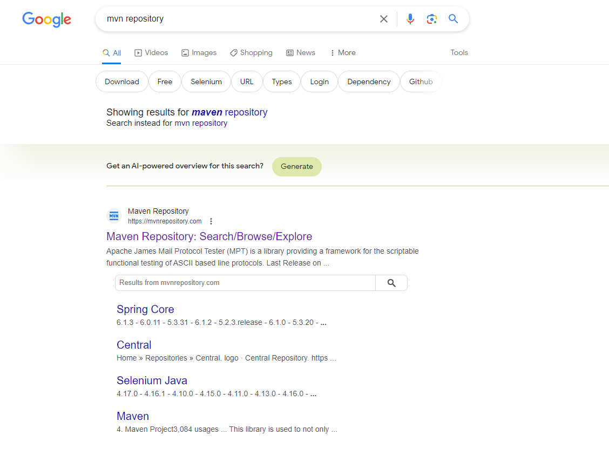
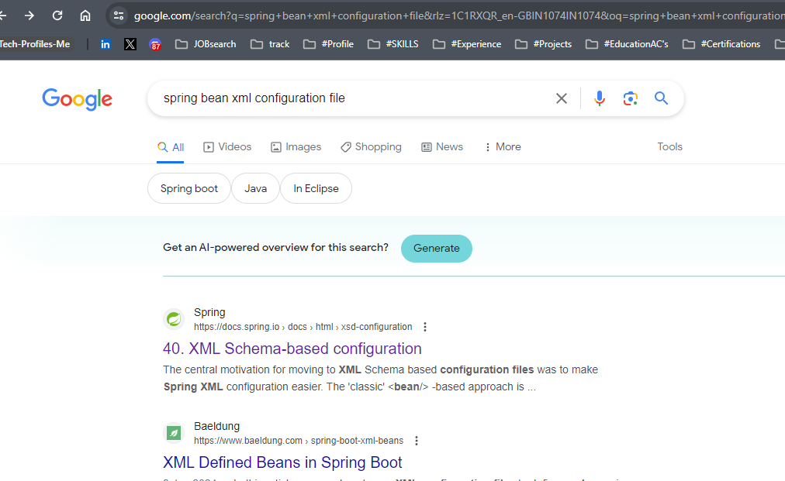

# Spring FW First Project with Maven


click the check box - (simple project)

Next

Group ID = like a package name (eg: com.hellotecky)
Artifact ID = like a Project name (eg: FirstSpringApp)

File structure


dependencies install in maven "pom.xml"


download the popular one and stable one.


paste it in pom.xml => in between the dependencies tag


configure using the xml file by creating it.


write in search box as "xml"

select xml file (not xml schema)




```xml
<?xml version="1.0" encoding="UTF-8"?>
<beans xmlns="http://www.springframework.org/schema/beans"
    xmlns:xsi="http://www.w3.org/2001/XMLSchema-instance"
    xsi:schemaLocation="
        http://www.springframework.org/schema/beans http://www.springframework.org/schema/beans/spring-beans.xsd">

    <!-- bean definitions here -->

</beans>
```


