first tomcat server has to be installed in the machine
then below process
# First Time Servlet App
on rightside you will find an icon after the search icon "open perspective"
select "JEE" to do your first servlet app


above image -> click on New Runtime 


select the respective server and it's version installed in your machine
->mine => apache tomcat 9.0


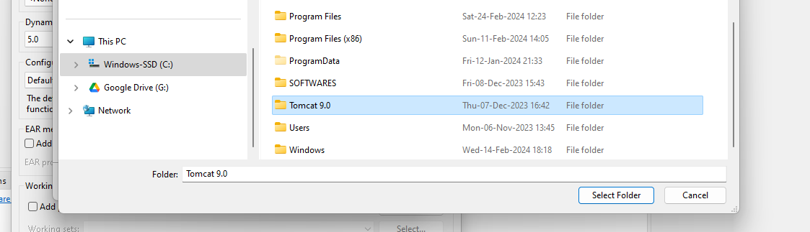


This is the project structure of servlet


## Next SetUp the Server in the IDE

click on it
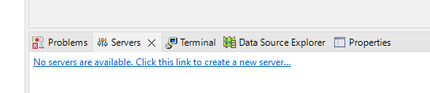

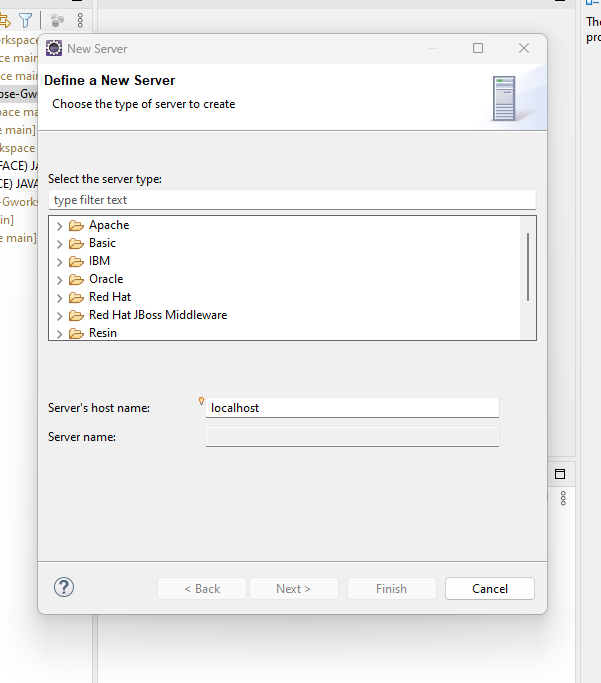

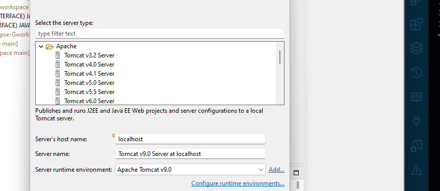


select app and click on add


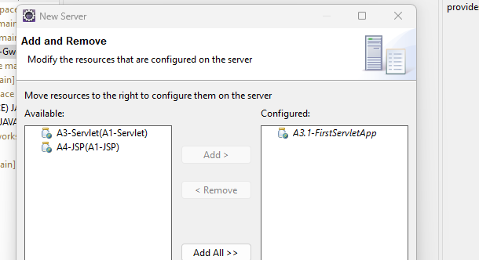
click on finish.

next run the server
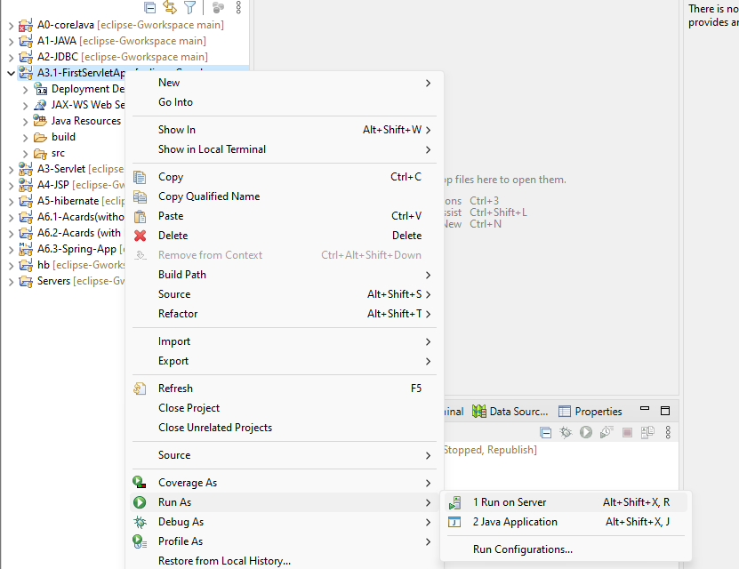

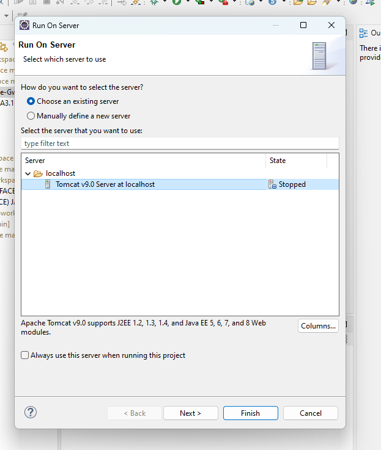

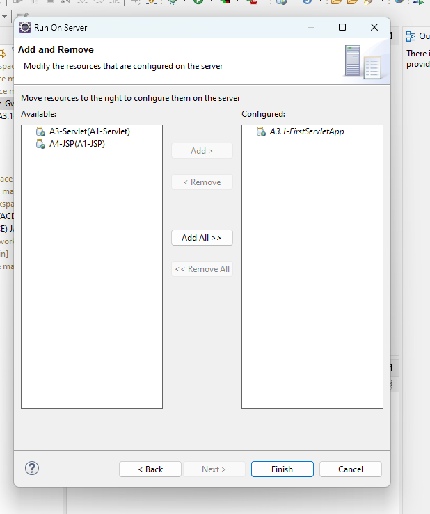
click on finish

output on the browser 
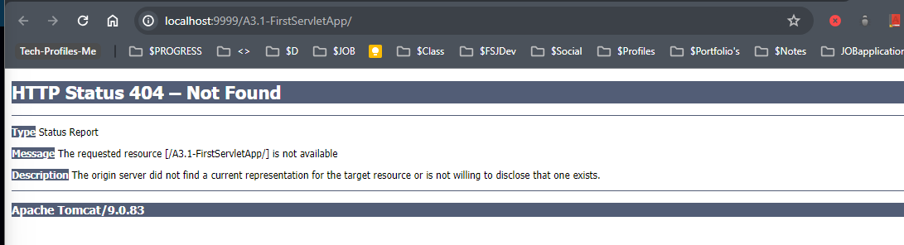

## Creating first servlet program
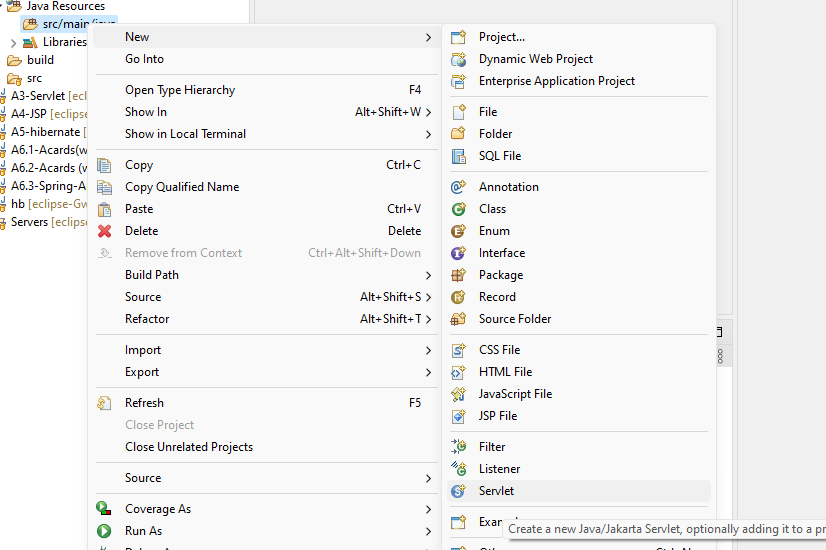

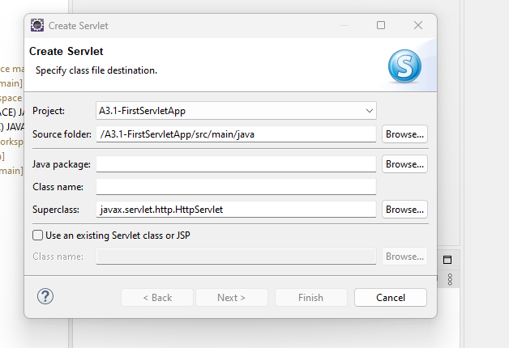

servlet is meant for processing logic so keep it in the controller
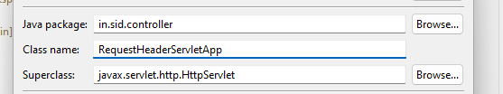

write servlet name in the classname.

click on next.

select and edit the url mapping as /test
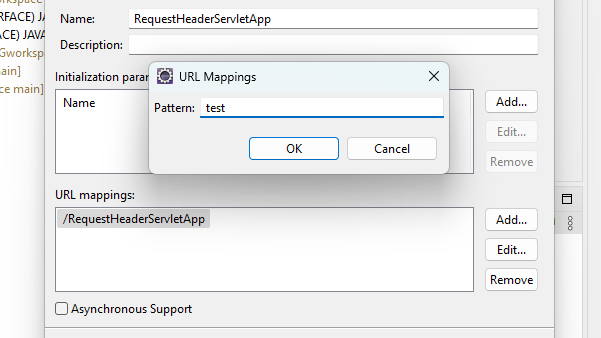
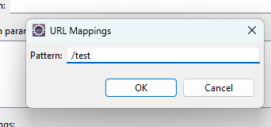

click on next.

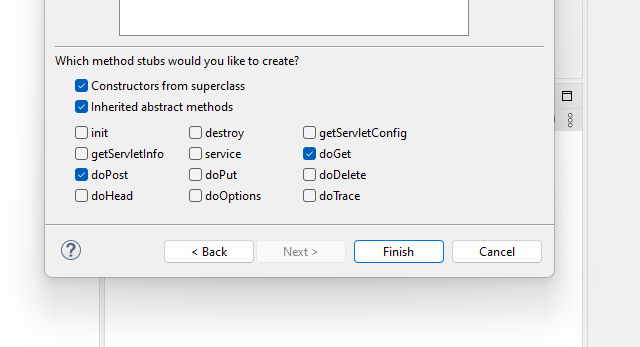

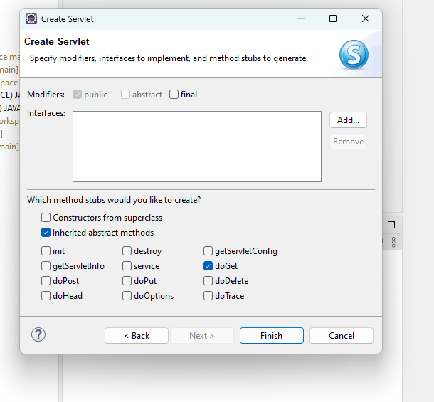

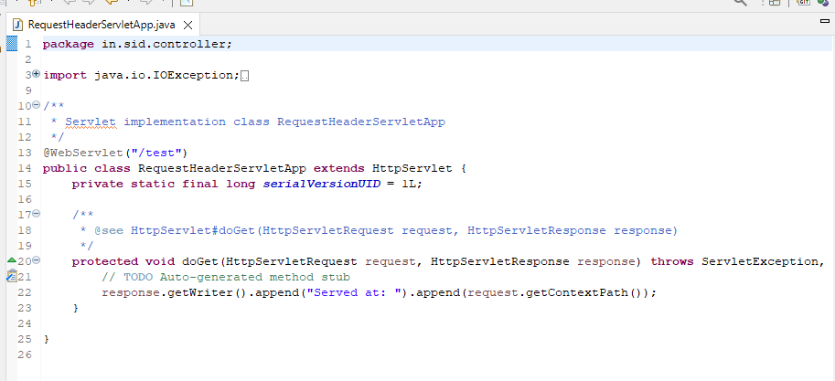

below is clean code
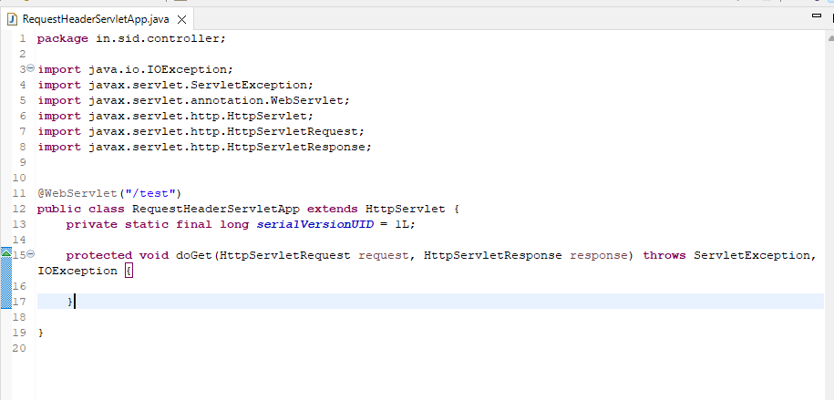

```java
	protected void doGet(HttpServletRequest request, HttpServletResponse response) throws ServletException, IOException {
		PrintWriter out =  response.getWriter(); 
		out.println("<h1>First Servlet App</h1>");
		out.close();
		
	}

```
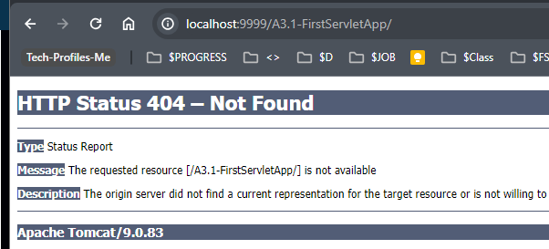

write the /test url in the url bar

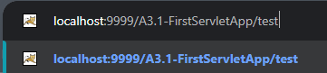

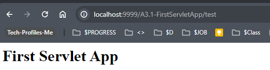
